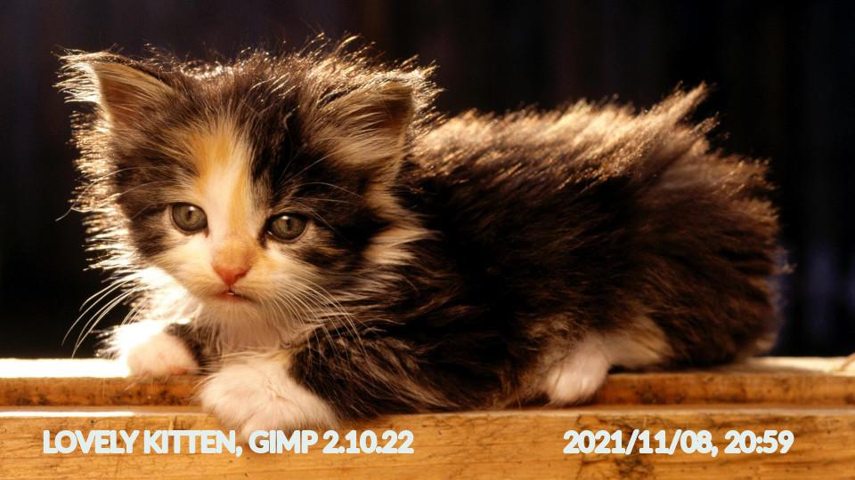

# ICaptioner - Image Captioner

[](https://pypi.org/project/icaptioner/)

Command line python script for adding captions to the images based on the metadata, filename or user input.

## Example

Source Image:


```console
icaptioner kitten.jpg
```

result:


```console
icaptioner kitten.jpg -c "LOVELY KITTEN, ##Software                      ##DateTime" --color=#e4eeed --size=30 --bold=2 -o "captioned2_kitten.jpg"
```

result:


## Installation

It is required to install **icaptioner** dependency from pypi repository.

```console
pip install icaptioner
```

## Usage

### CLI

```console
➜  ~/pictures icaptioner --help      
usage: icaptioner path caption_expression [options]

positional arguments:
  path                  File or directory location

optional arguments:
  -h, --help            show this help message and exit
  -c CAPTION, --caption CAPTION
                        Caption with variables support taken from metatags. To access variable in caption use e.g. ##DateTime
  -m, --metatags        Show file metatags
  -df DATEFORMAT, --dateformat DATEFORMAT
                        Date time format
  -o OUTPUT, --output OUTPUT
                        Output file or directory, by default adds 'captioned_' prefix
  -r, --overwrite       Overwrite already captioned photo with new one
  -p, --preview         Preview mode. Show only mode instead of save. Useful for testing. Only for specific file.
  --font FONT           Font type
  --size SIZE           Font size, by default automatically chosen.
  --color COLOR         Font color
  --bold BOLD           Font bold
  --singlethread        Use single thread (only works for directory)
  -v, --verbose         Increase logging severity

Examples:
    > icaptioner 20190116_111115.jpg -c "Party, ##DateTime - Captured with phone ##Make ##Model"
    > icaptioner images/ --output=captioned_images
    > icaptioner 20190116_111115.jpg -p --font=fonts/Lato-Regular.ttf --size=120 --color=#030360 --bold=3
    > icaptioner 20190116_111115.jpg -r -dateformat "%H:%M" --output=captioned.jpg

    Show metatags:
    > icaptioner 20190116_111115.jpg -m
    > icaptioner images/ -m

```

### Python library

It is possible to import **icaptioner** lib to your python project

Import library:

```python
from imagecaptioner.captioner import ImageCaptioner
```

It could be simply used:

```python
ImageCaptioner.add_captions(path="images/", output="captined_images", overwrite=1)
```

Overwrite image with caption:

```python
ImageCaptioner.add_captions(
    path="20190116_111115.jpg",
    caption="SUPER PARTY, ##DateTime captured with ##Made",
    dateformat="%H:%M",
    output="20190116_111115.jpg",
    overwrite=1,
    preview=None,
    font=None,
    size=86,
    color="#F5992A",
    bold=2,
)
```


